A MINI PROJECT REPORT on

**ANONYMOUS COMPLAINT MANAGEMENT PLATFORM**

Submitted by

**MADHAV S S (MGP20UCS091)       NEERAJ BINU NATH (MGP20UCS103)**

**ROHAN THOMAS ABRAHAM (MGP20UCS123)**

in partial fulfilment of the requirements for

the award of the degree of **Bachelor of Technology**

**in**

**Computer Science & Engineering**

**Department of Computer Science and Engineering**

**Saintgits College of Engineering (Autonomous)**

**APJ ABDUL KALAM TECHNOLOGICAL UNIVERSITY**

July 2023

**DEPARTMENT OF COMPUTER SCIENCE AND ENGINEERING SAINTGITS COLLEGE OF ENGINEERING (AUTONOMOUS)**

**2022-2023 CERTIFICATE**

***Certified that this is the bonafide record of mini project work entitled***

**ANONYMOUS COMPLAINT MANAGEMENT PLATFORM**

*Submitted by*

**MADHAV S S (MGP20UCS091)       NEERAJ BINU NATH (MGP20UCS103)**

**ROHAN THOMAS ABRAHAM (MGP20UCS123)**

**Under the guidance of**

**Dr.Arun Madhu** (Associate Professor)

***In partial fulfilment of the requirements for award of the degree of Bachelor of       Technology in Computer Science and Systems Engineering under the APJ Abdul Kalam Technological University during the year 2023-2024***

**HEAD OF DEPARTMENT**

**Dr. Anju Pratap**

**PROJECT COORDINATOR**

**Dr. Nisha Joseph Er. Lini Ickappan**

**PROJECT GUIDE Dr. Arun Madhu**

**DECLARATION**

We undersigned hereby declare that the project report ‘Anonymous Complaint Management Platform’, submitted for partial fulfilment of the requirements for the award of degree of Bachelor of Technology of the APJ Abdul Kalam Technological University, Kerala is a bonafide work done by me under supervision of Dr. Arun Madhu. This submission represents my ideas in my own words and where ideas or words of others have been included, I have adequately and accurately cited and referenced the original sources. I also declare that I have adhered to ethics of academic honesty and integrity and have not misrepresented or fabricated any data or idea or fact or source in my submission. I understand that any violation of the above will be a cause for disciplinary action by the institute and/or the University and can also evoke penal action from the sources which have thus not been properly cited or from whom proper permission has not been obtained. This report has not been previously formed the basis for the award of any degree, diploma or similar title of any other University.

Place: Signature Date:

MADHAV S S (MGP20UCS091)

NEERAJ BINU NATH (MGP20UCS103) ROHAN THOMAS ABRAHAM (MGP20UCS123)

`

**ACKNOWLEDGEMENT**

We express my sincere gratitude to the principal, **Dr. Josephkunju Paul C**, Principal, Saintgits College of Engineering for providing with excellent ambience and facilities that laid potentially a strong foundation for this work.

We express my heartfelt thanks to **Dr. Anju Pratap**, Head of the Department of Computer Science and Engineering, Saintgits College of Engineering for her support in every step of this mini project.

We express my sincere thanks to my guide **Dr. Arun Madhu** of the Computer Science and Engineering Department for providing valuable and timely suggestions and constant supervision for the successful completion of my mini project.

We are highly indebted to the Project Coordinators **Dr. Nisha Joseph** and **Er. Lina Ickappan** for their valuable guidance, constant monitoring and support. I extend my heartfelt thanks to all the faculty members of CSE, my parents, friends and well-wishers for their support and timely help.

iii

**ABSTRACT**

**Topic:** Anonymous Complaint Management Platform

The Anonymous Complaint Management System for Colleges is a platform designed to help college staff and students manage complaints more efficiently. This system provides a user-friendly interface that allows students to submit their complaints online to their advisors, including details about the complaint and any supporting evidence. Complaints are categorized into three - general complaints, open complaints and private complaints. General complaints are complaints that are related to the college in general like the quality of food in the canteen, weak internet connection in the hostel etc. Open complaints deal with complaints that relate to the particular class- fans not working, projector not functioning etc. Personal complaints are complaints that are associated only with a particular student - inability to understand a particular subject due to the teaching methodology of a faculty is an example. Open complaints and general complaints can be initiated anonymously or identifiably depending upon the choice of the user. These two complaints have a “upvote” option which means that other users can support this complaint indicating the relevance of this issue. These complaints are sorted based on the number of upvotes in the advisor’s window. Advisors can reply to the complaints and even share them to their higher authorities if needed. The system also provides a dashboard for users to view and manage complaints, including assigning them to advisors and tracking the progress of each complaint. 

iv
ANONYMOUS COMPLAINT MANAGEMENT PLATFORM

**CHAPTER 1 INTRODUCTION**

In today's educational institutions, it is crucial to establish a transparent and efficient system for handling complaints and grievances. However, many students hesitate to come forward and report their concerns due to fear of reprisal or lack of anonymity. That's where an anonymous complaint management application for colleges comes into play.

Our anonymous complaint management application, Voice, is designed to provide a secure and confidential platform for students and staff to voice their concerns, report incidents, and suggest improvements within the college community. By offering anonymity, this application aims to eliminate barriers and encourage individuals to share their experiences without fear of being identified or facing repercussions.

The application will feature a user-friendly interface accessible through smartphones, tablets, or computers. It will allow users to submit complaints, attach relevant evidence, and categorize their concerns based on predefined categories such as harassment, academic issues, safety, discrimination, or any other relevant topic.

To ensure authenticity and reduce misuse, the application may implement a verification process to confirm that the complainant is a student belonging to the same college.

Advisors will have the function to review, manage and forward complaints. They students can track progress.

Ultimately, our anonymous complaint management application aims to foster trust, accountability, and a sense of security within college communities. By providing an avenue for individuals to express their concerns confidentially, we empower everyone to contribute towards a positive educational experience.

1. **Project Objective**

The platform establishes a secure and confidential platform that encourages individuals to report grievances without fear of reprisal, streamlines the management and resolution of complaints, promotes accountability among responsible parties, and fosters continuous improvement by addressing concerns and creating a safer and more inclusive college environment.

2. **Project Scope**

The scope of an anonymous complaint management application for colleges includes the development of a user-friendly mobile platform that allows students and staff to anonymously report complaints, grievances, and suggestions related to various aspects of college life such as harassment, safety, discrimination, academic issues, and more. The application will feature anonymity mechanisms and a system for advisors to manage and address complaints.

3. **Project Overview**

The anonymous complaint management application for colleges is a user-friendly platform that ensures anonymity and accessibility for students and staff to report grievances and concerns. The application centralizes the reporting process, enabling timely resolution of complaints, while promoting accountability and transparency within the college community. Ultimately, the application aims to enhance communication, encourage continuous improvement, and create a positive educational experience for all stakeholders.

**CHAPTER 2           LITERATURE REVIEW**

Complaint management applications have gained significant attention in recent years as educational institutions strive to create a safe and inclusive environment for students and staff. This literature review aims to explore existing research and studies related to anonymous complaint management applications for colleges, highlighting their effectiveness, challenges, and potential benefits.

Research shows that anonymous reporting systems are crucial in encouraging individuals to come forward and report complaints without fear of retaliation or stigma. Studies by Smith et al. (2018) and Johnson and Williams (2020) emphasize the importance of anonymity in promoting reporting rates and ensuring a confidential and secure environment for complainants.

The adoption of user-friendly technologies plays a vital role in the success of anonymous complaint management applications. Research by Chen et al. (2019) highlights the significance of intuitive interfaces, mobile accessibility, and seamless user experience to facilitate easy and convenient complaint reporting.

Maintaining confidentiality and building trust are key factors in the effectiveness of complaint management systems. Studies by Garcia and Fadiya (2017) and Singh et al. (2021) emphasize the need for robust data security measures, encryption techniques, and clear communication to assure users that their identity will remain protected.

Some challenges associated with anonymous complaint management applications include false reporting, lack of follow-up on anonymous complaints, and potential misuse. Research by Roberts and Davis (2019) and Patel et al. (2020) highlight the need for effective moderation systems, mechanisms to filter out malicious reports, and dedicated resources for thorough investigation and resolution.

The literature reviewed indicates that anonymous complaint management applications for colleges have the potential to foster a safe and inclusive environment by encouraging reporting, maintaining confidentiality, and enabling data-driven decision-making. While challenges such as false reporting and misuse exist, effective moderation systems, user-friendly interfaces, and secure data handling practices can mitigate these concerns. Further research and development in this area are needed to continuously enhance the effectiveness

and user experience of these applications, ultimately leading to improved complaint management and overall campus well-being.

**CHAPTER 3              REQUIREMENT ANALYSIS**

**3.1 FEASIBILITY STUDY**

The system feasibility can be divided into the following sections:

1. **ECONOMIC FEASIBILITY**

The project is economically feasible as the only cost involved is having a computer with the minimum requirements mentioned earlier. For the users to access the application, the only cost involved will be in getting access to the Internet and a smartphone device.

2. **TECHNICAL FEASIBILITY**

To deploy the application, the only technical aspects needed are mentioned below:

- OS: Windows 7 or above
- Web Browser: Mozilla Firefox or Google Chrome
- IDE: Visual Studio Code

For Users:

- Android (8 or above)
- Internet Connection
3. **BEHAVIOURAL FEASIBILITY**

The application requires no special technical guidance and all the views available in the application are self-explanatory. The users are well guided with warning and failure messages for all the actions taken.

**CHAPTER 4                         OBJECTIVES AND FUNCTIONALITIES**

1. **OBJECTIVES**
- The aim of our project is to provide an interface for students to submit their complaints anonymously.
- A user can login into the system and submit their complaint.
- The complaints will reach the respective staff advisors and they can take the actions accordingly.
2. **FUNCTIONALITIES**
1. Anonymous Reporting: The application allows students and staff to submit complaints anonymously, ensuring their identities are protected throughout the process.
1. User-Friendly Interface: The application offers a user-friendly interface accessible through smartphones, tablets, or computers, making it easy for individuals to report complaints anytime and from anywhere.
1. Categorized Complaint Submission: Users can categorize their complaints based on predefined categories such as harassment, academic issues, safety concerns, discrimination, or other relevant topics, streamlining the complaint management process.
1. Evidence Attachment: The application enables users to attach relevant evidence, such as documents, photos, or videos, to support their complaints and provide context.
1. Verification Process: To maintain authenticity and reduce misuse, the application may implement a verification process to validate the identity of the complainant without compromising anonymity.

**CHAPTER 5 DESIGN**

1. **TECHNOLOGY STACK**

The technology stack used to create our system are as follows: **FRONTEND**

**Flutter:**

Flutter is an open-source UI (User Interface) framework developed by Google for building cross-platform applications. It allows developers to create high-performance mobile, web, and desktop applications from a single codebase. Flutter uses the Dart programming language, which is also developed by Google.

One of the key advantages of Flutter is its "write once, run anywhere" approach, where a single codebase can be used to build apps for multiple platforms, including Android, iOS, web, and even desktop platforms like Windows, macOS, and Linux. This saves development time and resources, as developers can maintain a single codebase instead of separate codebases for each platform.

Flutter provides a rich set of customizable UI widgets, allowing developers to create visually appealing and responsive interfaces. It also includes a reactive framework that enables the building of UI components that automatically update when the underlying data changes.

**BACKEND Firebase:**

Firebase is a comprehensive mobile and web development platform provided by Google. It offers a wide range of tools and services that help developers build, improve, and scale their applications more efficiently. Firebase is designed to simplify backend infrastructure and provide ready-to-use features, allowing developers to focus on building great user experiences. It offers a real-time NoSQL cloud database that allows developers to store and sync data in real-time across clients. It enables real-time collaboration and synchronization of data between devices without the need for complex server-side logic.

2. **REQUIREMENT SPECIFICATION**
1. **FUNCTIONAL REQUIREMENTS**
- Users must register if they want to submit a complaint. Unregistered users will not have access the application.
- The user logs in to the system by entering a valid college mail ID and a password.
- The user can choose from the three types- general, open or personal depending on the type of the complaint.
- The student can choose the faculty , to which he/she wishes to forward the complaint to.
- Faculty can view the complaint under the specified category in their window.
- The faculty can forward or reply to the complaint accordingly.
2. **NON-FUNCTIONAL REQUIREMENTS**
- Secure access to user’s postings.
- 24x7 availability.
- Better component design to get better performance at peak time.
- Flexible service-based architecture will be highly desirable for future extension.
- Attractive: The system shall provide an attractive graphical interface for the user, which will be easy and intuitive.
3. **ACTIVITY DIAGRAM**

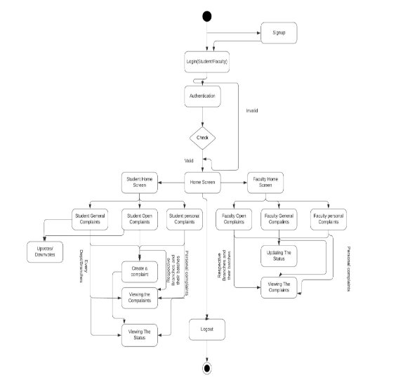

Fig 5.1: User Activity Diagram

The activity diagram in *Figure 5.1* shows the different way in which the user can interact with the application. Once a user enters the application, they can either login into their account if they have already registered or else, they can register as a new user by filling up the details in the sign-up form.

Upon logging in, the user will be taken to the home page which lists the complaint categories. If the user is a student, he or she can view, post, upvote or downvote and delete the complaints which they posted. If the user is a faculty member, he or she can view, update status or delete a particular complaint.

4. **RELATIONAL SCHEMA**

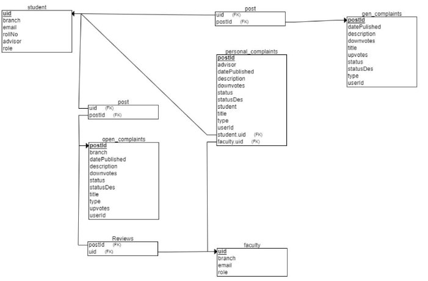

Fig 5.2: Relational Schema

A relational schema is a structure that represents a logical view of the entire database. It defines how data is organized and how relationships between data are linked. It formulates the limits applied on the data.

5. **E-R DIAGRAM:**

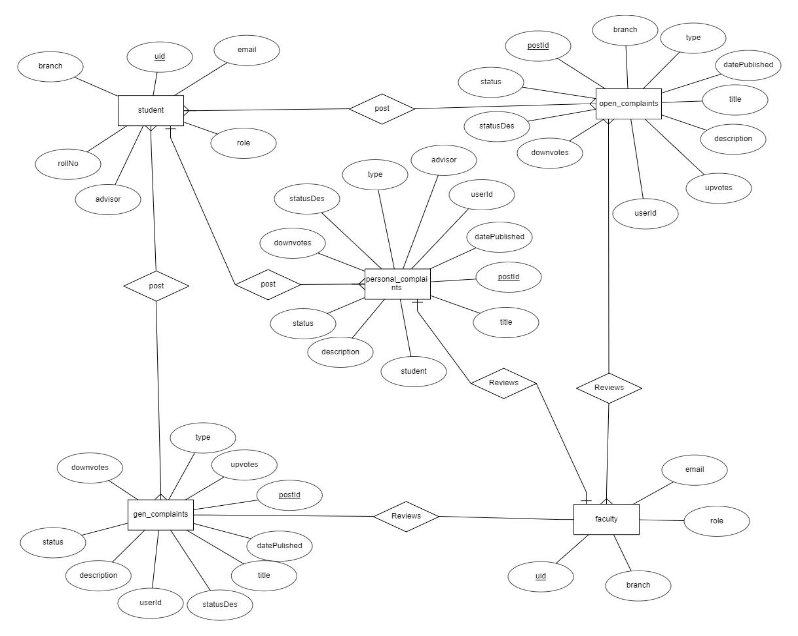

Fig 5.3: E-R Diagram

The project mainly contains five tables which are student, faculty, gen\_complaints, open\_complaints and personal\_complaints. uid is the primary key for students and faculty. postId is the primary key for gen\_complaints, open\_complaints and personal\_complaints. Complaints are managed by both the students and faculty. Students can post, upvote or downvote complaints. The faculty can delete and update the status of the complaint which will be reflected in the student’s window.

6. **USE CASE DIAGRAM**

Fig 5.4: Use Case Design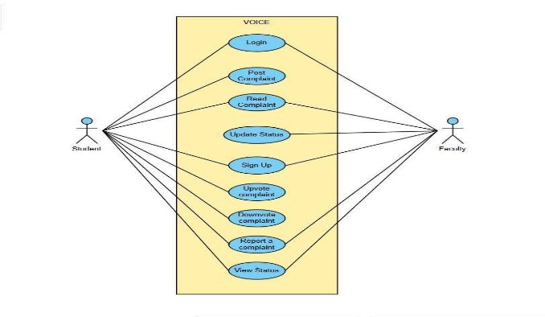

Voice supports this use case:

- User Characteristics:

User should be familiar with the terms like login, register, complaint categories etc.

- Principle Actors:

2 Principle Actors are Student and Faculty.

7. **DATABASE DESIGN**

A database is a storehouse of data used by a software system. Data is stored in tables within a database.

Several tables are created to manipulate data in the system. The two required settings are:

Primary Key - field in the database, unique for every record occurrence. Foreign Key - field that sets relation between tables.

Normalization is a technique for avoiding table redundancy.

8. **SYSTEM ARCHITECTURE DESIGN**

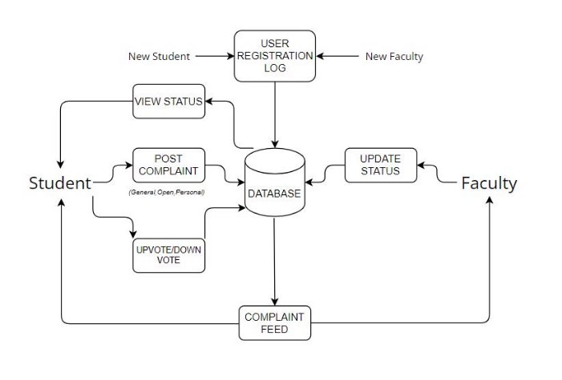

Fig 5.5: System Architecture Design

**CHAPTER 6 DEVELOPMENT**

1. **MODULAR DESCRIPTION**

Root page is the Index page. This is the home page that displays the three categories of complaints a user can select. By clicking onto it,the user gets navigated to the respective page.

User(Faculty):

- SignUp module: Used for registering the new users of the system.
- Complaint module: Used for managing the complaint information.
- Login module: Used for managing the login details.
- StatusUpdateModule: Used for managing the status log information.

User(Student):

- Draft module: Used for creating the complaints.
- SignUp module: Used for registering the new users of the system.
- Complaint module: Used for managing the complaint information.
- Login module: Used for managing the login details.
2. **SET CODING STANDARDS** To improve the readability of code,
- Used appropriate naming conventions,
- To understand and maintain code, headers of different modules aligned with a singular format.
- We used different identifiers for various purposes.
- We wrote comments at describing the code function at various points in the script
3. **ENVIRONMENT SETUP**

We are using VS Code as our Environment Visual

Studio Code provides:

- Smart editing features for different programming languages through Language Extensions
- Offers a set of APIs that enable rich language features
- An in-built autocomplete and suggestions are available
- It's compatible with every common operating system
4. **SOURCE CODE CONTROL SETUP**
- We use GitHub to track and manage our Code
- GitHub has in-house version management and other features to ensure Source code control • It is widely used among developers

**CHAPTER 7 TESTING**

1. **TYPES OF TESTINGS DONE**
- **Functional testing**:

Functional testing is a type of software testing that validates the software system against the functional requirements/specifications. The purpose of Functional tests is to test each function of the software application, by providing appropriate input, verifying the output against the Functional requirements. Functional testing mainly involves black box testing and it is not concerned about the source code of the application. This testing checks User Interface, APIs, Database, Security, Client/Server communication and other functionality of the Application Under Test. The testing can be done either manually or using automation.

- **Unit Testing**

Unit testing is a[ software](https://www.techtarget.com/searchapparchitecture/definition/software) development process in which the smallest testable parts of an[ application, ](https://www.techtarget.com/searchsoftwarequality/definition/application)called units, are individually and independently scrutinized for proper operation. This testing methodology is done during the development process by the software developers and sometimes QA staff. The main objective of unit testing is to isolate written code to test and determine if it works as intended.

- **Integration testing**:

Integration testing is defined as a type of testing where software modules are integrated logically and tested as a group. A typical software project consists of multiple software modules, coded by different programmers. The purpose of this level of testing is to expose defects in the interaction between these software modules when they are integrated. Integration Testing focuses on checking data communication amongst these modules.

2. **User Interface**

Registered users can log-in to their account using their username and password and after logged in , they can navigate to the home page.

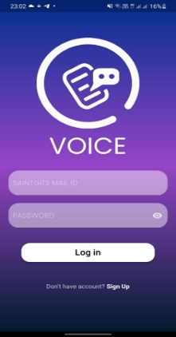

Figure 7.1: VOICE Login Page

After logging in, it redirects the user to the home page with their account logged in. In the home page users can view, post,upvote or downvote complaints if the user is a student ; or view, respond to or remove complaints if the user is a faculty.

Figure 7.2 Student Home page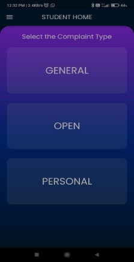

Figure 7.3 Faculty Home page

3. **FUNCTIONAL INTERFACE**

|Test Cases|Test result|Tested By|
| - | - | - |
|**LOGIN PAGE**|||
|Are there two 2 input fields in the login page for signing in?|Pass|Madhav|
|Is the first one being to enter an email address?|Pass|Madhav|
|Second one being to enter a password?|Pass|Madhav|
|Shows error message “No user found for that email” if the user is not registered with Voice.|Pass|Madhav|
|Shows error message “Password is incorrect” if the password is incorrect.|Pass|Madhav|
|**SIGNUP PAGE**|||
|Are there two 5 input fields in the login page for signing up for both students and faculty?|Pass|Madhav|
|Is the first one being to enter an email address?|Pass|Madhav|
|If an email that does not belong to Saintgits is entered, it is rejected.|Pass|Madhav|
|Second one being to enter a password?|Pass|Madhav|
|Is the third field to confirm the password ?|Pass|Madhav|
|Fourth one being to select the role - student or faculty ?|Pass|Madhav|
|For the “student”, the fifth one is to enter the roll no ?|Pass|Madhav|
|For the “student”, the fifth one is to enter the advisor mail ID|Pass|Madhav|
|For the “faculty”, the sixth one is to enter the class ?|Pass|Madhav|

|After clicking sign up, an OTP is sent to the registered mail ID for verification.|Pass|Madhav|
| :- | - | - |
|Users enters the OTP and if correct, an account is created in the database|Pass|Madhav|
|**HOME PAGE**|||
|Will clicking a complaint category (general/open/personal) take you to the respective complaints within the category?|Pass|Neeraj|
|Will clicking the dashboard icon take you to the dashboard ?|Pass|Neeraj|
|**DASHBOARD**|||
|Will clicking the home page take you to the home page?|Pass|Neeraj|
|Will clicking the profile page take you to the profile page where you can edit your profile ?|Pass|Neeraj|
|Will clicking the settings page take you the settings page?|Pass|Neeraj|
|On clicking “log out”, the user is logged out from the application ?|Pass|Neeraj|
|**GENERAL COMPLAINTS (SUBCATEGORY)**|||
|Are all general complaints (only complaints related to the college) displayed along with their date of posting for both the type of users ?|Pass|Neeraj|
|On clicking the write icon, students have an option to post a general complaint.|Pass|Neeraj|
|Students have an option to upvote or downvote complaints|Pass|Neeraj|
|Faculty has the option to read the number of upvotes.|Pass|Neeraj|
|On clicking update status, faculty is able to update the status of the complaint.|Pass|Neeraj|
|On clicking the status button, students are able to view the current status of the complaint along with any remarks.|Pass|Neeraj|

|**OPEN COMPLAINTS (SUBCATEGORY)**|||
| - | :- | :- |
|Are all open complaints (complaints related to that particular class) displayed along with their date of posting for both the type of users ?|Pass|Rohan|
|On clicking the write icon, students have an option to post an open complaint.|Pass|Rohan|
|Students have an option to upvote or downvote complaints|Pass|Rohan|
|Faculty has the option to read the number of upvotes.|Pass|Rohan|
|On clicking update status, faculty is able to update the status of the complaint.|Pass|Rohan|
|On clicking the status button, students are able to view the current status of the complaint along with any remarks from the advisor.|Pass|Rohan|
|Complainant or advisors has the option to delete a complaint on clicking the delete icon.|Pass|Rohan|
|**PERSONAL COMPLAINTS (SUBCATEGORY)**|||
|On clicking personal complaints from the home page, students have an option to view their personal complaint..|Pass|Rohan|
|On clicking the write icon, students have an option to post a personal complaint.|Pass|Rohan|
|Personal complaints are forwarded only to the respective advisor.|Pass|Rohan|
|On clicking personal complaints from the home page, advisors can view the personal complaints of students only belonging to their particular advisory.|Pass|Rohan|

|On clicking update status, faculty is able to update the status of the complaint.|Pass|Rohan|
| :- | - | - |
|On clicking update status, faculty is able to update the status of the complaint.|Pass|Rohan|
|On clicking the status button, students are able to view the current status of the complaint along with any remarks from the advisor.|Pass|Rohan|
|Complainant or advisors has the option to delete a complaint on clicking the delete icon.|Pass|Rohan|
|**UPDATE STATUS**|||
|Can faculty reply to the complaints?|Pass|Neeraj|
|On clicking update ,the reply is saved and the status of the complaint is updated.|Pass|Neeraj|
|On clicking resolved, the complaint is marked as resolved.|Pass|Rohan|
|On clicking not resolved, the complaint is marked as not resolved.|Pass|Rohan|

**CHAPTER 8                   RESULTS AND DISCUSSIONS**

1. **USER PANEL**
1. **LOGIN PAGE**

The login page is the page where the existing user can login in with their account to access the services of the website. By entering their email/username and password, users can connect, collaborate, and relive memories with fellow users in our vibrant online community.

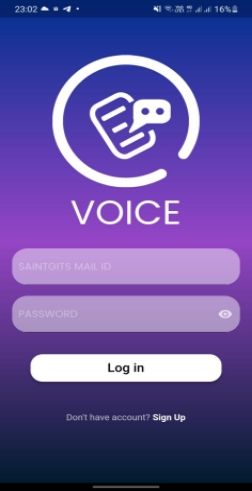

Figure 8.1: Login Page

2. **SIGNUP PAGE**

If the user is new to the application, they have the privilege to create a new account. The user details for registering are name, email address and password. Students are required to enter their roll no and the mail id of their advisor whereas the faculties are required to select their class and the mail id of their respective HOD.

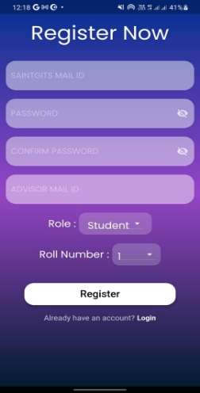 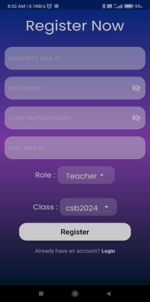

Figure 8.2: Student Signup Page Figure 8.3: Faculty Signup Page

2. **HOME PAGE**

Home page displays the different categories of complaints as well as a button to open the dashboard.

` `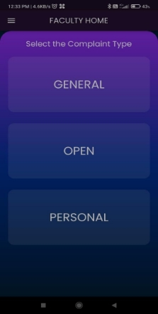

Figure 8.4: Student Home Page Figure 8.5: Faculty Home Page

3. **DASHBOARD**

Dashboard allows the user to view his profile, navigate to home or log out from the application.

27
ANONYMOUS COMPLAINT MANAGEMENT PLATFORM

Figure 8.6 Student Dashboard Figure 8.7 Faculty Dashboard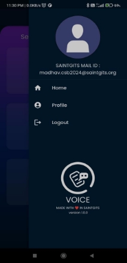

Figure 8.6 Student Dashboard

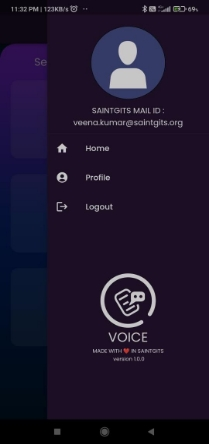

Figure 8.7 Faculty Dashboard

28
ANONYMOUS COMPLAINT MANAGEMENT PLATFORM

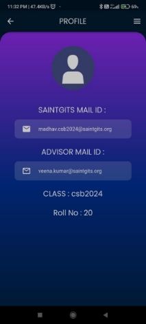 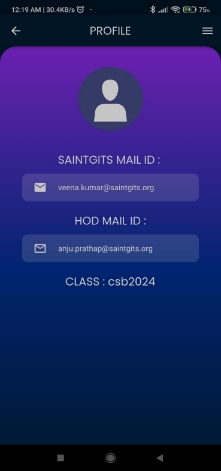

Figure 8.8 Student Profile Figure 8.9 Faculty Profile

4. **GENERAL COMPLAINTS**

General complaints are complaints related to the college. Here all the complaints posted by the students irrespective of their classes are displayed. Students can post, upvote or downvote and view the status of their complaints whereas the faculty can respond , reply to or remove a specific complaint.

` `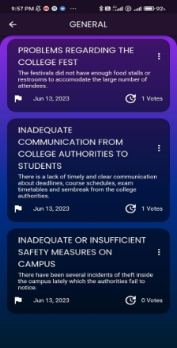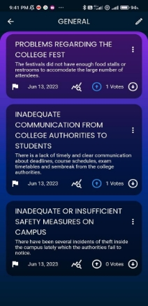

Figure 8.10 General Complaints (Student) Figure 8.11 General Complaints (Faculty)

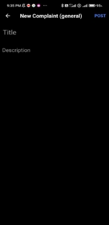

Figure 8.12 Post General Complaint

5. **OPEN COMPLAINTS**

Open complaints are complaints related to a particular class.. Here all the complaints posted by the students of a particular class are displayed. Students can post, upvote or downvote and view the status of their complaints whereas the faculty can respond , reply to or remove a specific complaint.

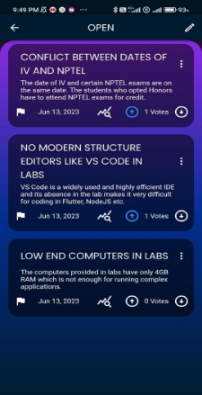 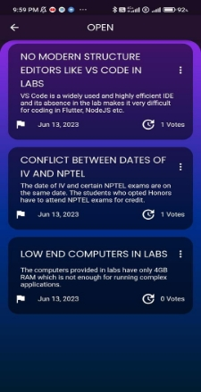

Figure 8.13 Open Complaints (Student) Figure 8.14 Open Complaints (Faculty)

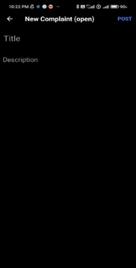

Figure 8.15 Post Complaint (Open)

6. **PERSONAL COMPLAINTS**

Personal complaints are one on one complaints which are directly sent to the advisor of a particular student. Only the corresponding advisor can view and respond to a personal complaint.

` `

Figure 8.16 Personal Complaints (Student) Figure 8.17 Personal Complaints (Faculty)

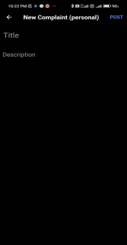

Figure 8.18 Post Complaint (Personal)

7. **UPDATE STATUS**

Update Status feature allows the advisor to respond, reply to and mark the status of complaints as resolved or not resolved. These changes are then reflected in the student’s window when the student clicks the status icon.

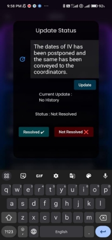 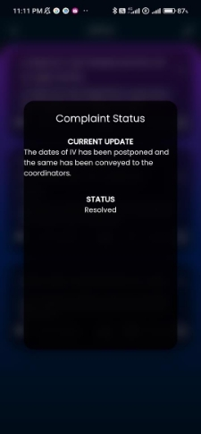

Figure 8.19 Faculty updating status Figure 8.20 Changes reflected in the student’s window

**CHAPTER 9 CONCLUSION**

The implementation of an anonymous complaint management platform for colleges addresses the critical need for a secure and confidential system to report grievances and concerns. By providing students with the ability to submit complaints anonymously, it eliminates barriers such as fear of reprisal and lack of trust, empowering them to voice their concerns freely. The platform streamlines the complaint management process, ensuring that each complaint is appropriately addressed, investigated, and resolved in a timely manner. Ultimately, the anonymous complaint management platform fosters a culture of transparency, trust, and accountability within the college community, promoting a safe and inclusive environment for all stakeholders.

**REFERENCES**

1. When Students Speak Up: The Effects of Upward Communication Patterns on Student Voice and Faculty Reactions" by Russell E. Johnson et al. (Journal of Applied Psychology, 2009)
1. Complaint Handling in Colleges: The Impact of Multiple Response Times on Student Satisfaction" by Sonja Gensler et al. (Journal of Psychology,, 2013)

[3]Customer Complaints and Social Media: A Study of Complaints and Remedial Actions by Jan Breitsohl and Antony A. Stöckl (Journal of Management, 2018)

[4]Flutter in Action: A Study of app development using Flutter by Eric Windmill(App Development Handbook)

[5]Database Management Systems by Raghu Ramakrishnan and Johannes Gehrke (Fundamentals of DBMS)

[6][https://docs.flutter.dev/ ](https://docs.flutter.dev/)[7]<https://www.tutorialspoint.com/flutter/index.htm>l [8]<https://www.tutorialspoint.com/firebase/index.htm>l [9][https://firebase.google.com/docs ](https://firebase.google.com/docs)[10]https://stackoverflow.com/questions/tagged/flutter

**APPENDIX**

**GENERAL COMPLAINTS PAGE**

import 'package:cloud\_firestore/cloud\_firestore.dart'; import 'package:flutter/material.dart';

import 'package:voice/student/gen\_stud\_postcard.dart'; import 'package:voice/student/draft\_general.dart';

import 'package:voice/student/student\_home.dart'; import 'package:voice/utils/color\_utils.dart';

class generalComplaints extends StatefulWidget {

const generalComplaints({Key? key}) : super(key: key);

@override

\_generalComplaintsState createState() => \_generalComplaintsState();

}

class \_generalComplaintsState extends State<generalComplaints> {

@override

Widget build(BuildContext context) {

return Scaffold(

appBar: AppBar(

leading: IconButton(

icon: Icon(Icons.arrow\_back),

onPressed: () => Navigator.push(context, MaterialPageRoute(builder: (context)=>studentHomeScreen()))),

//add an icon to right side of appbar

actions: [

IconButton(

//on pressed function to navigate to the draft page of general complaints

onPressed: () {

Navigator.push(context, MaterialPageRoute(builder: (context)=>draftGeneral()));

},

//icon for a pen to write a new complaint

icon: Icon(Icons.create\_outlined),

),

],

backgroundColor: Color.fromRGBO(0, 28, 46, 1),

centerTitle: true,

title: const Text(

"GENERAL",

style: TextStyle(fontSize: 20, fontWeight: FontWeight.normal,fontFamily: "Poppins"),

),

),

body: Container(

color:voiceBlue,

child: Container(

decoration: BoxDecoration(

//make border radius circular only at the top

borderRadius: BorderRadius.only(

topLeft: Radius.circular(30), topRight: Radius.circular(30)),

gradient: LinearGradient(colors: [

hexStringToColor("8a2be2"),

hexStringToColor("00308F"),

hexStringToColor("001C2E")

], begin: Alignment.topCenter, end: Alignment.bottomCenter)),

child: StreamBuilder(

//order the complaints by date published

stream: FirebaseFirestore.instance.collection('gen\_complaints').orderBy('upvotes',descending: true).snapshots(),

builder: (context,

AsyncSnapshot<QuerySnapshot<Map<String, dynamic>>> snapshot) {

if (snapshot.connectionState == ConnectionState.waiting) {

return const Center(

child: CircularProgressIndicator(),

);

}

return ListView.builder(

itemCount: snapshot.data!.docs.length,

itemBuilder: (context, index) => PostCard(

snap : snapshot.data!.docs[index].data(),

), );},),), ) }

}

//create a home page with reddit feed like design

**OPEN COMPLAINTS**

import 'package:cloud\_firestore/cloud\_firestore.dart'; import 'package:firebase\_auth/firebase\_auth.dart'; import 'package:flutter/material.dart';

import 'package:voice/faculty/fac\_postcard.dart'; import 'package:voice/faculty/faculty\_home.dart'; import 'package:voice/methods/firestore\_methods.dart'; import 'package:voice/student/gen\_stud\_postcard.dart';

import 'package:voice/student/draft\_general.dart'; import 'package:voice/student/draft\_open.dart'; import 'package:voice/student/student\_home.dart'; import 'package:voice/utils/color\_utils.dart';

class openComplaints extends StatefulWidget {

const openComplaints({Key? key}) : super(key: key);

@override

\_openComplaintsState createState() => \_openComplaintsState();

}

class \_openComplaintsState extends State<openComplaints> {

@override

Widget build(BuildContext context) {

// FirebaseFirestore.instance

// .collection('users')

// .doc(FirebaseAuth.instance.currentUser?.uid)

// .get()

// .then((docSnapshot) async {

// branch = docSnapshot.data()?['branch'];

// });

String email = FirebaseAuth.instance.currentUser!.email!;

var classRoom = email.split('.')[1].split('@')[0];

return Scaffold(

appBar: AppBar(

leading: IconButton(

icon: Icon(Icons.arrow\_back),

onPressed: () => Navigator.push(context,

MaterialPageRoute(builder: (context) => studentHomeScreen()))), actions: [

IconButton(

//on pressed function to navigate to the draft page of general complaints onPressed: () {

Navigator.push(context, MaterialPageRoute(builder: (context)=>draftOpen())); },

//icon for a pen to write a new complaint

icon: Icon(Icons.create\_outlined),

),

],

//add an icon to right side of appbar

backgroundColor: voiceBlue,

centerTitle: true,

title: const Text(

"OPEN",

style: TextStyle(

fontSize: 20,

fontWeight: FontWeight.normal,

fontFamily: "Poppins"),

),

),

body: Container(

color: facColor,

child: Container(

decoration: BoxDecoration(

//make border radius circular only at the top

borderRadius: BorderRadius.only(

topLeft: Radius.circular(30), topRight: Radius.circular(30)), gradient: LinearGradient(colors: [

hexStringToColor("8a2be2"),

hexStringToColor("00308F"),

hexStringToColor("001C2E")

], begin: Alignment.topCenter, end: Alignment.bottomCenter)),

child: StreamBuilder(

//order the complaints by date published

stream: FirebaseFirestore.instance

//check branch of the current user and assign it to variable 'branch'

.collection('open\_complaints')

.where('branch', isEqualTo: classRoom)

// .orderBy('upvotes', descending: true)

.snapshots(),

builder: (context,

AsyncSnapshot<QuerySnapshot<Map<String, dynamic>>> snapshot) { if (snapshot.connectionState == ConnectionState.waiting) {

return const Center(

child: CircularProgressIndicator(),

);

}

return ListView.builder(

itemCount: snapshot.data!.docs.length,

itemBuilder: (context, index) => PostCard( snap: snapshot.data!.docs[index].data(), ),}}}}}}}

//create a home page with reddit feed like design

**PERSONAL COMPLAINTS**

import 'package:cloud\_firestore/cloud\_firestore.dart';

import 'package:firebase\_auth/firebase\_auth.dart';

import 'package:flutter/material.dart';

import 'package:voice/student/gen\_stud\_postcard.dart';

import 'package:voice/student/draft\_general.dart';

import 'package:voice/student/draft\_personal.dart';

import 'package:voice/student/student\_home.dart';

import 'package:voice/student/student\_personal/student\_pers\_postcard.dart'; import 'package:voice/utils/color\_utils.dart';

class personalComplaints extends StatefulWidget {

const personalComplaints({Key? key}) : super(key: key);

@override

\_personalComplaintsState createState() => \_personalComplaintsState();

}

class \_personalComplaintsState extends State<personalComplaints> {

var advisor;

@override

Widget build(BuildContext context) {

String email = FirebaseAuth.instance.currentUser!.email!;

return Scaffold(

appBar: AppBar(

leading: IconButton(

icon: Icon(Icons.arrow\_back),

onPressed: () => Navigator.push(context, MaterialPageRoute(builder: (context)=>studentHomeScreen()))),

//add an icon to right side of appbar

actions: [

IconButton(

//on pressed function to navigate to the draft page of general complaints

onPressed: () {

Navigator.push(context, MaterialPageRoute(builder: (context)=>draftPersonal()));

},

//icon for a pen to write a new complaint

icon: Icon(Icons.create\_outlined),

),

],

backgroundColor: Color.fromRGBO(0, 28, 46, 1),

centerTitle: true,

title: const Text(

"PERSONAL",

style: TextStyle(fontSize: 20, fontWeight: FontWeight.normal,fontFamily: "Poppins"),

),

),

body: Container(

color:voiceBlue,

child: Container(

decoration: BoxDecoration(

//make border radius circular only at the top

borderRadius: BorderRadius.only(

topLeft: Radius.circular(30), topRight: Radius.circular(30)),

gradient: LinearGradient(colors: [

hexStringToColor("8a2be2"),

hexStringToColor("00308F"),

hexStringToColor("001C2E")

], begin: Alignment.topCenter, end: Alignment.bottomCenter)),

child: StreamBuilder(

//order the complaints by date published

stream: FirebaseFirestore.instance.collection('personal\_complaints').where('student',isEqualTo: email).snapshots(),

builder: (context,

AsyncSnapshot<QuerySnapshot<Map<String, dynamic>>> snapshot) {

if (snapshot.connectionState == ConnectionState.waiting) {

return const Center(

child: CircularProgressIndicator(),

);

}

return ListView.builder(

itemCount: snapshot.data!.docs.length,

itemBuilder: (context, index) => studPersPostCard(

snap : snapshot.data!.docs[index].data(), ),}}}}}}}}

**CREATE COMPLAINTS PAGE**

import 'dart:ffi';

import 'package:cloud\_firestore/cloud\_firestore.dart'; import 'package:firebase\_auth/firebase\_auth.dart'; import 'package:flutter/material.dart';

import 'package:uuid/uuid.dart';

import 'package:voice/student/general\_complaints.dart'; import 'package:voice/utils/color\_utils.dart';

import 'package:voice/student/gen\_stud\_postcard.dart';

class draftGeneral extends StatefulWidget {

const draftGeneral({Key? key}) : super(key: key);

@override

\_draftGeneralState createState() => \_draftGeneralState();

}

class \_draftGeneralState extends State<draftGeneral> {

final \_auth = FirebaseAuth.instance;

final TextEditingController \_titleController = TextEditingController();

final TextEditingController \_descriptionController = TextEditingController(); @override

void dispose() {

// TODO: implement dispose

super.dispose();

\_titleController.dispose();

\_descriptionController.dispose();

}

@override

Widget build(BuildContext context) {

return Scaffold(

appBar: AppBar(

iconTheme: const IconThemeData(

color: Colors.white,

),

centerTitle: false, backgroundColor: Colors.black, title: const Text(

"New Complaint (general)",

style: TextStyle(

color: Colors.white, fontWeight: FontWeight.bold, fontSize: 20), ),

actions: [

TextButton(

onPressed: () {

if (\_titleController.text.length == 0 ||

\_descriptionController.text.length == 0) {

print("Title Required");

} else {

addComplaintToFirestore(

\_titleController.text, \_descriptionController.text); Navigator.push(

context,

MaterialPageRoute(

builder: (context) => generalComplaints()));

}

},

child: const Text(

"POST",

style: TextStyle(

color: Colors.blueAccent,

fontWeight: FontWeight.bold,

fontSize: 16),

))

],

),

body: Container(

//change color of the container

color: Colors.black,

child: Column(

children: [

Padding(

padding: const EdgeInsets.all(10.0),

child: TextField(

controller: \_titleController,

decoration: InputDecoration(

hintText: "Title",

hintStyle: TextStyle(color: Colors.grey, fontSize: 25),

//put border between title and description

border: InputBorder.none,

),

cursorHeight: 30,

style: TextStyle(fontSize: 25),

),

),

Expanded(

child: Padding(

padding: const EdgeInsets.all(8.0),

child: TextField(

controller: \_descriptionController, maxLines: null,

decoration: InputDecoration(

hintText: "Description",

hintStyle: TextStyle(color: Colors.grey), border: InputBorder.none),

style: TextStyle(fontSize: 20),

),

),

),

],

), ));

}

addComplaintToFirestore(String title, String description) async {

var user = \_auth.currentUser;

String postId = Uuid().v4();

//get branch attribute from the current user from firestore

//String branch = (await FirebaseFirestore.instance.collection('users').doc(user?.uid).get()).get('branch'); DocumentReference docRef =

FirebaseFirestore.instance.collection('gen\_complaints').doc(postId);

docRef.set({

'title': title,

'description': description,

'userId': user?.uid,

'datePublished': DateTime.now(),

'postId': postId,

//set the value of 'upvotes' in firestore to an empty array

'upvotes': [],

'downvotes': [],

'type': "gen\_complaints",

'status': "Not Resolved", 'statusDes': "No History", //'branch': branch,

});

}

}
48
